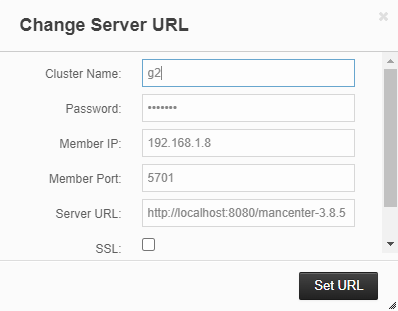

# Management Center

Hazelcast Management Center es una aplicación web para monitorear y administrar clústeres de Hazelcast. Proporciona información en tiempo real sobre el estado de los nodos y clústeres de Hazelcast, como la cantidad de datos almacenados, la cantidad de operaciones de lectura y escritura, la cantidad de conexiones de clientes y la cantidad de operaciones de MapReduce.

<u>Instalación rápida de Management Center:</u>

1. Descargar el WAR del Management Center 3.8.5 (compatible con la versión 3.8.6 de Hazelcast)
   desde aquí: [Hazelcast Management Center 3.8.5](https://repository.hazelcast.com/download/management-center/management-center-3.8.5.zip)


2. Se requiere un Tomcat que utilice JDK 8. Puedes utilizar la siguiente imagen de Docker:
   [https://hub.docker.com/r/tomcat:8-jre8](https://hub.docker.com/layers/library/tomcat/9.0.82-jre8/images/sha256-14e413b6e4396e531a30c2b515757268e706c7227df678558f48b5e2131616f7?context=explore)

```bash
docker pull tomcat:9.0.82-jre8
```

3. Descomprime el archivo .zip descargado e inicia un contenedor de Tomcat y monta un volumen local para poder copiar el archivo WAR dentro del contenedor.

```bash
docker run -d -p 8080:8080 --name tomcat-jre8 -v $(pwd)/tomcat-webapps:/usr/local/tomcat/webapps tomcat:9.0.82-jre8
```

4. Copia el archivo WAR descargado en el directorio `tomcat-webapps` que se creó en el paso anterior.

```bash
cp path/to/mancenter-3.8.5.war tomcat-webapps/
```

5. Accede a la URL de Management Center en tu navegador web: [http://localhost:8080/mancenter-3.8.5](http://localhost:8080/mancenter-3.8.5)

   <u>Aclaración:</u> es probable que se necesite reinciar el contenedor.


6. Cree un usuario y contraseña para acceder a Management Center.


7. Al correr un nodo, agregar los siguientes flags a la JVM:
```
--add-opens java.management/sun.management=ALL-UNNAMED
--add-opens jdk.management/com.sun.management.internal=ALL-UNNAMED
```

8. Además agregar el siguiente parámetro al correr el nodo:
```
-DmanagementCenter=true
```

9. Desde la opción Update Cluster URL, ingrese el Cluster Name y Password correspondientes a la GroupConfig del server.
<p style="text-align: center; margin-top: 10px;">
  
</p>